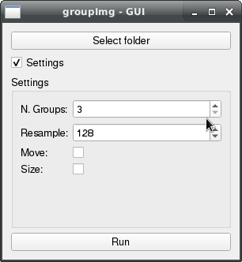

# groupImg

A python script to organize your images by similarity.

It uses a [k-means](https://en.wikipedia.org/wiki/K-means_clustering) algorithm to separatem them in clusters.

Watch it working below.

[](http://www.youtube.com/watch?v=M6ntIaynKCg)

## Why ?

It was about one year since I made the switch from Windows to Linux, and I wanted to get better at the terminal. I always thought it was cool to master it. To make a long story short, one day I did mount a linux image on my external backup drive instead of the pen drive. Some basic */dev/sd\** confusion. Anyway's, I overwrited all my photos; so I used [Foremost](https://en.wikipedia.org/wiki/Foremost_(software)) (which is a great tool) to recover them. It recovered 350.000 images; miniatures, textures, profile pictures, wallpapers... and among all that my personal photos. So I wrote a little script to divide the images in folders, 1000 images per folder, if I'm not mistaken. I went through all the folders separating my photos from the random images that weren't important. To end the story, I came up with this script to "cluster" the photos by similiraty and makes things a little easier for me.

## How to use

Navigate to the folder you want. CLI - Command Line Interface or GUI - Graphic User Interface

Install the requirements.txt

```
pip install -r requirements.txt
```

### CLI

Call the script passing the image folder you want to organize.

```
python groupimg.py -f /home/user/Pictures/
```

## Parameters

\-f folder where your images are (use absolute path).
```groupimg -f /home/user/Pictures```

\-k number of folders you want to separate your images. 
```groupimg -f /home/user/Pictures -k 5```

\-m if you want to move your images instead of just copy them.

\-s if you want the algorithm to consider the size of the images as a feature.

### GUI



Just call the groupImgGUI.py file.

```
python groupImgGUI.py
```

Click the button Select folder to select the folder with the pictures you want to organize.

You can adjust the settings by checking the settings box.

N. Group - How many groups should the images be separated in.

Resample - Size to resample the image before comparing (small sizes gives fast results).

Move - Move the images instead of copy them (useful if you have low space on your hard drive).

Size - Consider the size of the images to organize them (useful if you want to separate thumbnails from real pictures).

[](https://www.paypal.com/cgi-bin/webscr?cmd=_donations&business=victorqribeiro%40gmail%2ecom&lc=BR&item_name=Victor%20Ribeiro&item_number=donation&currency_code=USD&bn=PP%2dDonationsBF%3abtn_donateCC_LG%2egif%3aNonHosted)
